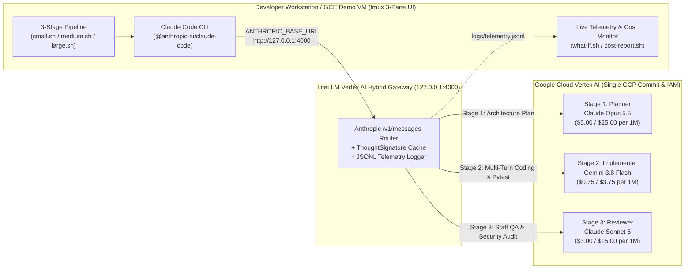

# Claude Code + Gemini 3.8 Flash on Vertex AI (LiteLLM Multi-Agent Router)

> **Keep the exact Claude Code (`@anthropic-ai/claude-code`) CLI developer experience your engineers love — while cutting agentic coding token spend by ~74% and accelerating multi-turn tool execution by 2.6x on Google Cloud Vertex AI.**

---

## Executive Summary: Why Hybrid Multi-Agent Routing on Vertex AI?

In real-world agentic software engineering, **85% to 92% of total tokens and tool-call turns** are consumed not during initial architectural planning or final code review, but inside the **iterative Stage 2 Implementation Loop** (`Read` $\rightarrow$ `Edit` $\rightarrow$ `Bash pytest` $\rightarrow$ `Read` $\rightarrow$ `Edit`).

Running that high-volume tool-execution loop on a frontier $5/$25 model (`claude-opus-5-5`) creates an unsustainable token bill and high multi-turn prefill latency. By routing **Claude Code** through **LiteLLM on Google Cloud Vertex AI**, engineering organizations assign the right frontier model to each stage of the software lifecycle under a single GCP billing account, IAM perimeter, and enterprise commit:

| Pipeline Stage | Agent Role | Default Vertex AI Model | Pricing (Input / Output per 1M) | Why This Model Wins Here |
| :--- | :--- | :--- | :--- | :--- |
| **Stage 1** | **Planner** (`.claude/agents/planner.md`) | **Claude Opus 5.5** (`claude-opus-5-5`) | `$5.00` / `$25.00` | Deep architectural reasoning & root-cause defect localization in a single pass (~7% of run tokens). |
| **Stage 2** | **Implementer** (`.claude/agents/implementer.md`) | **Gemini 3.8 Flash** (`gemini-3.8-flash`) | **`$0.75` / `$3.75`** | Blazing-fast multi-turn tool calling (`Read`, `Edit`, `Write`, `Bash`) at **85% lower cost than Opus 5.5** and **75% lower cost than Sonnet 5** (~88% of run tokens). |
| **Stage 3** | **Reviewer** (`.claude/agents/reviewer.md`) | **Claude Sonnet 5** (`claude-sonnet-5`) | `$3.00` / `$15.00` | Independent cross-family staff QA & security verification (~5% of run tokens). |

> **100% Configurable**: Every stage (`PLANNER_MODEL`, `IMPLEMENTER_MODEL`, `REVIEWER_MODEL`) is configurable via `config/models.env`, `./configure-models.sh`, or CLI flags (`--planner`, `--implementer`, `--reviewer`).

---

## Architecture Diagram



---

## Live Verified Benchmark Results (`./small.sh`)

Below is an actual live telemetry capture from running `./small.sh` (Token-Bucket API Rate Limiter & Tiered Burst CLI — 5 defective paths across `rate_limiter.py` and `cli.py`) through the `claude` CLI on Vertex AI:

### 1. Per-Stage Execution Breakdown
| Stage | Vertex AI Model | API Turns | Tool Calls | Input Tokens | Output Tokens | Token Share | API Time | Actual Cost (USD) |
| :--- | :--- | ---: | ---: | ---: | ---: | ---: | ---: | ---: |
| **Planner** | `Claude Opus 5.5` | 1 | 0 | 6,244 | 1,357 | 7.4% | 13.36s | `$0.06514` |
| **Implementer** | **`Gemini 3.8 Flash`** | **12** | **11** | **87,529** | **3,243** | **88.5%** | **65.67s** | **`$0.07781`** |
| **Reviewer** | `Claude Sonnet 5` | 1 | 0 | 3,751 | 436 | 4.1% | 5.93s | `$0.01779` |
| **TOTAL** | **Hybrid 3-Agent** | **14** | **11** | **97,524** | **5,036** | **100.0%** | **84.96s** | **`$0.16075`** |

### 2. Counterfactual What-If Analysis — Small Task (102,560 Tokens & 11 Tool Calls)
| Architecture Scenario | Run Cost | Savings vs 100% Opus | Est. Run Time | Time Saved | Annual Spend (100 Devs) | Annual Savings | Dev Hours Saved/Yr |
| :--- | ---: | ---: | ---: | ---: | ---: | ---: | ---: |
| **★ Hybrid Vertex AI (Opus 5.5 + Gemini 3.8 Flash + Sonnet 5)** | **`$0.16075`** | **`-73.8%`** | **`85.0s`** | **`-139.4s` (2.6x)** | **`$60,280/yr`** | **`$169,790/yr`** | **`14,519 hrs/yr`** |
| 100% Claude Opus 5.5 (All 3 Stages on Opus 5.5) | `$0.61352` | baseline | `224.3s` | baseline | `$230,070/yr` | `$0/yr` | `0 hrs/yr` |
| Anthropic-Only Tiered (Opus 5.5 Plan + Sonnet 5 Implement/Review) | `$0.39417` | `-35.8%` | `131.7s` | `-92.6s` | `$147,814/yr` | `$82,256/yr` | `9,650 hrs/yr` |
| 100% Claude Sonnet 5 (All 3 Stages on Sonnet 5) | `$0.36811` | `-40.0%` | `143.1s` | `-81.2s` | `$138,042/yr` | `$92,028/yr` | `8,458 hrs/yr` |
| 100% Gemini 3.8 Flash (Budget Mode) | `$0.09203` | `-85.0%` | `80.9s` | `-143.4s` | `$34,511/yr` | `$195,560/yr` | `14,938 hrs/yr` |

### 3. Live Verified Benchmark Results (`./medium.sh` — 5-Module Payment Microservice, 236,662 Tokens & 20 Tool Calls)
| Stage | Vertex AI Model | API Turns | Tool Calls | Input Tokens | Output Tokens | Token Share | API Time | Actual Cost (USD) |
| :--- | :--- | ---: | ---: | ---: | ---: | ---: | ---: | ---: |
| **Planner** | `Claude Opus 5.5` | 1 | 0 | 7,901 | 1,253 | 3.9% | 12.11s | `$0.07083` |
| **Implementer** | **`Gemini 3.8 Flash`** | **21** | **20** | **217,750** | **4,440** | **93.9%** | **86.61s** | **`$0.17996`** *(vs `$1.19975` on Opus)* |
| **Reviewer** | `Claude Sonnet 5` | 1 | 0 | 4,838 | 480 | 2.2% | 5.51s | `$0.02171` |
| **TOTAL** | **Hybrid 3-Agent** | **23** | **20** | **230,489** | **6,173** | **100.0%** | **104.23s** | **`$0.27251` (`-79.1%` vs All-Opus `$1.30677`)** |

> **Medium Task Enterprise Annual Impact (100 Devs × 15 Tasks/Day = 375,000 Runs/Yr)**:
> - **Hybrid Vertex AI Spend**: `$102,190/yr` vs `$490,039/yr` on 100% Claude Opus 5.5 (**`$387,849/yr` net savings**, **`-79.1%`**, and **`29,849 developer hours/yr` saved**).

---

## One-Line Demo Commands

Once connected to the demo workstation (or inside your local checkout):

```bash
# 1. Run the Small Benchmark (Token-Bucket Rate Limiter & CLI — ~60-85s)
./small.sh

# 2. Run the Medium Benchmark (Payment & Order Fulfillment Microservice: HMAC + Idempotency + Circuit Breaker)
./medium.sh

# 3. Run the Large Benchmark (5-Module Cloud FinOps Anomaly Detector + SQLite + REST API + HTML Dashboard)
./large.sh

# 4. View the Live Telemetry & Executive What-If Cost/Speed Report (also writes logs/latest_report.html)
./cost-report.sh

# 5. Simulate Any Custom What-If Model Combination & Enterprise Team Size
./what-if.sh --planner claude-opus-5-5 --implementer gemini-3.7-flash --reviewer claude-sonnet-5 --devs 250

# 6. Switch Active Agent Models (or choose a preset: default, all-opus, all-sonnet, budget)
./configure-models.sh --preset default
```

> **Tip**: When launched inside an interactive terminal with `tmux`, `./small.sh`, `./medium.sh`, and `./large.sh` automatically open a **3-pane live command center** (Left: Claude Code 3-stage execution; Top-Right: Real-time LiteLLM Vertex AI token/cost monitor; Bottom-Right: Live workspace file & `pytest` watcher). Pass `--no-tmux` to run in a single terminal stream.

---

## Repository Structure

```text
claude-code-with-gemini/
├── small.sh                         # 1-click Small benchmark launcher
├── medium.sh                        # 1-click Medium benchmark launcher
├── large.sh                         # 1-click Large benchmark launcher
├── cost-report.sh                   # Executive ANSI + HTML telemetry & What-If report
├── what-if.sh                       # Counterfactual model & enterprise ROI simulator
├── configure-models.sh              # Switch Planner / Implementer / Reviewer models
├── requirements.txt                 # SHA-256 hash-pinned dependencies (go/pip-install-remediation)
├── config/
│   ├── models.env                   # Configurable PLANNER_MODEL, IMPLEMENTER_MODEL, REVIEWER_MODEL
│   └── litellm_config.yaml          # LiteLLM proxy router declaration for Vertex AI
├── .claude/
│   ├── settings.json                # Claude Code project settings & tool permissions
│   └── agents/                      # Specialized sub-agent definitions (planner, implementer, reviewer)
├── src/
│   ├── catalog.py                   # Authoritative Vertex AI Model Garden pricing & thinking rules
│   ├── litellm_vertex_gateway.py    # Anthropic /v1/messages <-> Vertex AI gateway & telemetry logger
│   └── what_if_engine.py            # Counterfactual cost/latency simulator & HTML report generator
├── scripts/
│   ├── run_pipeline.py              # 3-stage Claude Code orchestrator (Planner -> Implementer -> Reviewer)
│   ├── live_monitor.py              # Top-right tmux pane real-time telemetry & savings dashboard
│   ├── workspace_watch.py           # Bottom-right tmux pane live pytest & workspace watcher
│   └── launch_demo.sh               # Shared tmux / foreground launcher
├── tasks/
│   ├── small/                       # Token-Bucket API Rate Limiter & Tiered Burst CLI
│   ├── medium/                      # Payment & Order Fulfillment Microservice
│   └── large/                       # Cloud FinOps Cost Anomaly Platform & Dashboard
├── click-to-deploy/                 # 2-stage go/demos Terraform Click-to-Deploy package
└── tests/                           # Unit tests for gateway protocol translation & What-If engine
```
